<h1 align="center">Marek Wywiał</h1>
<h3 align="center">Python Developer</h3>

<picture>
  <source media="(prefers-color-scheme: dark)" srcset="https://raw.githubusercontent.com/onjin/onjin/output/github-contribution-grid-snake-dark.svg" />
  <source media="(prefers-color-scheme: light)" srcset="https://raw.githubusercontent.com/onjin/onjin/output/github-contribution-grid-snake.svg" />
  
</picture>

have fun with my old game (mostly in Polish): <pre>telnet direct.onjin.net 4000</pre>

<!--p></p-->

  <a href="https://github.com/onjin/stars">@onjin/stars</a> |
   <a href="https://github.com/onjin/nix-dev">@onjin/nix-dev</a> |
      <a href="https://github.com/onjin/samlvpn-nix">@onjin/samlvpn-nix</a>
    

<!--
**onjin/onjin** is a ✨ _special_ ✨ repository because its `README.md` (this file) appears on your GitHub profile.

Here are some ideas to get you started:

- 🔭 I’m currently working on ...
- 🌱 I’m currently learning ...
- 👯 I’m looking to collaborate on ...
- 🤔 I’m looking for help with ...
- 💬 Ask me about ...
- 📫 How to reach me: ...
- 😄 Pronouns: ...
- ⚡ Fun fact: ...
-->
